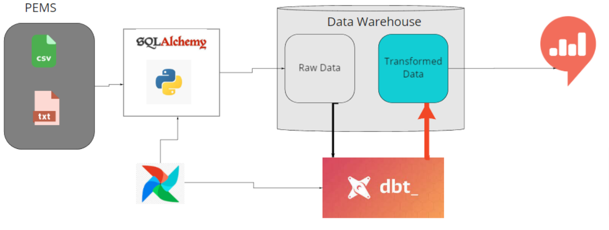

# Sql Migration
A pipeline for transforming Extracting, Loading and Transforming data to businesses
“The only constant thing in life is change”.  ~Heraclitus
Or more radically:
“When you are finished changing, you are finished.” ~Benjamin Franklin
With the current speed of new innovations in the data space, building modular, loosely coupled, and programmatically adaptable solutions for your tech stack is essential to move fast and deliver value to your stakeholders. 
In this case, your AI startup has gotten some sales, some revenue, and some publicity = traction.  This has led to you getting an investor, with some tech background.  Your investor is insisting that a new, more scalable, tech-stack be deployed as a condition for the 2nd tranche of her investment into your firm.


<p align="center">
  <h3 align="center">Sql Migration Project</h3>

  <p align="center">
    A fully dockerized ELT pipeline project, using Microsoft SQL, dbt, Apache Airflow, and Apache Superset.
    <br />
    <a href="#"><strong>Explore the docs »</strong></a>
    <br />
    <br />
  </p>
</p>


<!-- TABLE OF CONTENTS -->
<details open="open">
  <summary>Table of Contents</summary>
  <ol>
    <li>
      <a href="#about-the-project">About The Project</a>
      <ul>
        <li><a href="#built-with">Built With</a></li>
      </ul>
    </li>
    <li>
      <a href="#getting-started">Getting Started</a>
      <ul>
        <li><a href="#prerequisites">Prerequisites</a></li>
        <li><a href="#installation">Installation</a></li>
      </ul>
    </li>
    <li><a href="#usage">Usage</a></li>
    <li><a href="#roadmap">Roadmap</a></li>
    <li><a href="#contributing">Contributing</a></li>
    <li><a href="#license">License</a></li>
    <li><a href="#contact">Contact</a></li>
    <li><a href="#acknowledgements">Acknowledgements</a></li>
  </ol>
</details>


<!-- ABOUT THE PROJECT -->
## About The Project



Using a docker-compose file, developed a completely dockerized ELT pipeline with PostgreSQL for data storage, Airflow for automation and orchestration, DBT for data transformation, and a Redash dashboard connected to the PostgreSQL database.
### Built With

Tech Stack used in this project
* [MSSql](https://docs.microsoft.com/en-us/sql/?view=sql-server-ver16)
* [Apache Airflow](https://airflow.apache.org/docs/apache-airflow/stable/)
* [dbt](https://docs.getdbt.com/)
* [Apache Superset](https://superset.apache.org/docs/intro/)


<!-- GETTING STARTED -->
## Getting Started


### Prerequisites

Make sure you have docker installed on local machine.
* Docker
* DockerCompose
  
### Installation

1. Clone the repo
   ```sh
   git clone https://github.com/tutorialcreation/sqlmigration.git
   ```
2. Run
   ```sh
    docker-compose build
    docker-compose up
   ```
3. Open Airflow web browser
   ```JS
   Navigate to `http://localhost:8000/` on the browser
   activate and trigger dbt_load_dag
   activate and trigger dbt_dbt_dag
   ```
4. Access redash dashboard
   ```JS
   Navigate to `http://localhost:5000/` on the browser
   ```
5. Access your PostgreSQL database using adminar
   ```JS
   Navigate to `http://localhost:8080/` on the browser
   choose PostgreSQL databse
   use `root` for username
   use `pssd` for password
   ```

<!-- CONTRIBUTING -->
## Contributing

Contributions are what make the open source community such an amazing place to learn, inspire, and create. Any contributions you make are **greatly appreciated**.

1. Fork the Project
2. Create your Feature Branch (`git checkout -b feature/AmazingFeature`)
3. Commit your Changes (`git commit -m 'Add some AmazingFeature'`)
4. Push to the Branch (`git push origin feature/AmazingFeature`)
5. Open a Pull Request


<!-- LICENSE -->
## License

Distributed under the MIT License. See `LICENSE` for more information.


<!-- CONTACT -->
## Contact

Martin Luther - [@email](https://www.linkedin.com/in/martin-bironga-0338a418b/) - tutorialcreation81@gmail.com


<!-- ACKNOWLEDGEMENTS -->
## Acknowledgements
* [10 Academy](https://www.10academy.org/)


